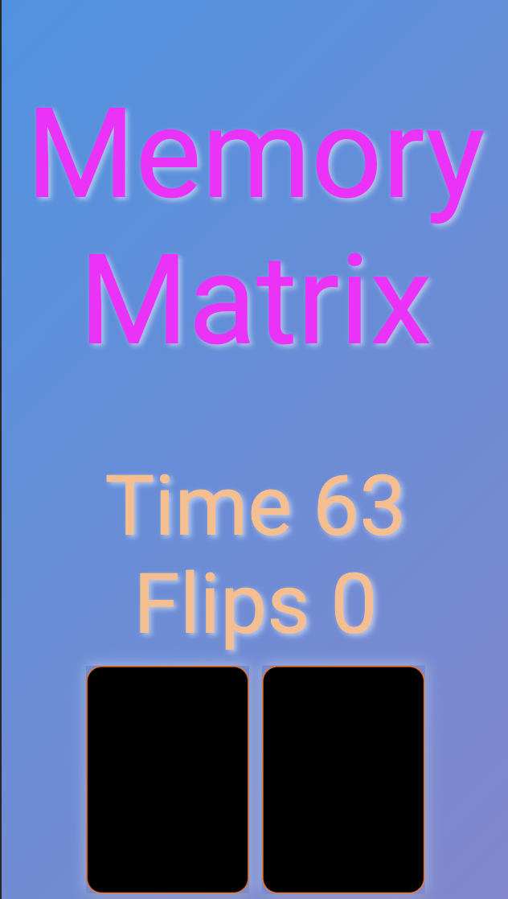

# Project Documentation: Memory Matrix

## Project Rationale

### Project Introduction

The **Memory Matrix** game is designed to challenge and enhance the memory skills of its users. The idea stemmed from the recognition of the cognitive benefits associated with memory games, making it an engaging and educational experience.

To view the deployed website click [here](https://kierancg.github.io/Milestone2CardPairs/).

### Project Goals and Objectives

The primary goal of the project is to create an interactive and enjoyable memory game accessible to a wide audience. Objectives include providing a user-friendly interface, integrating external APIs for additional content, and implementing features that enhance the overall gaming experience.

### Target Audience

The target audience includes individuals of varying ages and interests, from casual gamers looking for a quick mental exercise to those interested in memory improvement activities. But predominantly it was built for myself to demonstrate use of a website enabled Javascript game.

### Scope and Features

The project includes features such as card flipping animations, victory and game over overlays, a countdown timer, and integration with an external API to fetch random quotes. The scope is limited to creating a standalone Memory Matrix game with the potential for future enhancements.

## Development Life Cycle

### Planning

#### Project Kickoff

- **Objective:** Create a card pair game that meets the testing criteria of the course.
- **Activities:**
  - I wanted to make a simple game that showcases some good programming language and easy to understand design that anyone can immediately pick up and play.
  - The webpage must meet as many of the courses criteria as possible so I'll refer back to them at all stages during design and implementation.

#### Requirements Gathering

- **Objective:** Identify detailed requirements to inform the design and development process.
- **Activities:**
  - Consider your preferences and expectations as the sole developer and end user.
  - Define technical requirements, including supported platforms and browsers.

1. **Card Flipping:**
   - Players can flip cards to reveal their faces.
   - Cards should flip smoothly with a visual animation.

2. **Matching Mechanism:**
   - The game should identify and respond to matching pairs of cards.

3. **Countdown Timer:**
   - Implement a countdown timer to create a sense of urgency.
   - Players should complete the game within a specified time limit.
   - There is a time limit due to course constraints so extra features may have to be a follow up project.

#### Content Requirements

Content requirements specify the specific elements, visuals, and information needed for the game.

1. **Card Faces:**
   - Utilize a variety of visual elements for card faces (e.g., icons, symbols, or images).
   - Ensure a visually appealing and easily distinguishable set of card faces.

2. **Overlay Texts Content:**
   - Craft engaging content for overlay texts, providing a narrative for game start, victory, and game over.

3. **Quotes Content:**
   - Ensure the quotes don't distract from the game but provide a pleasant addition.

#### Additional Notes

- All game elements and features should contribute to a positive and engaging user experience.
- Maintain a balance between challenge and accessibility to cater to a wide audience.
- Regularly playtest the game to refine mechanics and ensure an enjoyable gaming experience.

#### Initial Design Decisions

- **Objective:** Make key design decisions to guide the solo development process.
- **Activities:**
  - Design the user interface with a focus on personal usability and accessibility.
  - Determine the visual style, including colors, fonts, and the overall theme.
  - Decide on game mechanics and interactions.
  - Consider the potential use of external APIs, such as fetching random quotes.

#### Project Timeline

- **Objective:** Create a realistic timeline for solo development with milestones.
- **Activities:**
  - Design 1 week, Implementation 3 weeks, Testing 3 days, Deployment 1 day.
  - Key milestones, HTML Framework completed with basic CSS styling. Javascript game runs without errors. Deployment and Testing passes.
  - Project should take a month to complete with scope for mitigating circumstances.

#### Risk Assessment

- **Objective:** Identify potential challenges and plan personal mitigation strategies.
- **Activities:**
  - First time coding javascript for a project so risk of not meeting deadlines. Also first time writing and deploying Jest for a personal project.
  - It is likely that getting to grips with Javascript for the first time will make this a slow project so I've given that the lions share of the projects timeframe. Writing the Jest tests is also new to me so I'll be including manual testing alongside Jest to make sure I've planned redundancies.

### Design

#### Agile Project Development

The development of the Memory Matrix game follows an Agile project development lifecycle. Agile principles have been applied to promote flexibility and iterative improvements throughout the development process.

##### Iterative Development

The project is divided into iterative cycles or sprints, each focusing on specific features and enhancements. This approach allows for continuous refinement and adaptation based on feedback and evolving requirements.

##### User-Centric Design

The design process prioritizes the user experience, ensuring that the game is intuitive, engaging, and accessible. Regular feedback loops, including playtesting and user feedback, contribute to user-centric design decisions.

#### User Interface (UI) Design

The user interface design aims to provide a visually appealing and seamless gaming experience.

##### Color Scheme

The color scheme is carefully chosen to enhance visibility, accessibility, and overall aesthetics. The linear gradient background promotes a dynamic and engaging atmosphere within the game.

##### Typography

The Roboto font from Google Fonts is selected for its readability and modern appearance. Consistent font styles contribute to a cohesive and professional UI.

##### Layout and Responsiveness

The game layout is designed to be responsive, adapting to various screen sizes and devices. Grid-based layouts enhance the organization of game elements, providing a structured and visually appealing interface.

#### Game Elements and Features

The design of game elements and features contributes to an immersive and enjoyable gameplay experience.

##### Card Faces

A diverse set of visual elements, including icons representing animals, adds variety and interest to the card faces. Each card face is carefully designed to be visually distinct.

##### Overlay Texts

Overlay texts, such as "Click to Start," "Game Over," and "Victory," provide clear instructions and feedback throughout the game. The neon text effect enhances visibility.

#### External APIs Integration

The game incorporates an external API to fetch random quotes, adding an interactive and educational element to the gaming experience.

##### Quotes Container

A dedicated container displays random quotes fetched from the external API. This feature aims to entertain and inspire players.

#### Next Steps

The design will continue to evolve based on user feedback and iterative development. The Agile approach allows for ongoing improvements and the addition of new features in response to user needs.

### Implementation

#### Technologies Used

The implementation of the Memory Matrix game involves the use of various technologies to create a fully functional and interactive web application. Key technologies include:

- **HTML:** The structure of the game is defined using HTML, providing a foundation for content presentation.

- **CSS:** Cascading Style Sheets are used to style and enhance the visual elements of the game, ensuring a polished and cohesive appearance.

- **JavaScript:** The game logic and interactivity are implemented using JavaScript, creating a dynamic and engaging user experience.

#### Folder Structure

The project follows a well-organized folder structure for easy navigation and maintenance. Here's an overview:

#### HTML Structure

The HTML file (`index.html`) defines the structure and content of the game. Key components include:

- **Title and Meta Tags:** Ensuring proper rendering and responsiveness across devices.

- **External Stylesheets and Scripts:** Links to the external stylesheet (`style.css`) and game script (`game.js`).

- **Game Elements:** Structure for the game title, overlay texts, game container, cards, and quotes container.

#### CSS Styling

The CSS file (`style.css`) is responsible for styling the HTML elements, ensuring a visually appealing and consistent design. Highlights include:

- **Global Styling:** Setting box-sizing, defining the body background, and ensuring a consistent font style.

- **Page Title Styling:** Neon text effect for the game title, pulse animation, and consistent font style.

- **Game Container Layout:** Grid-based layout for the game, styling for individual cards, and card faces.

- **Overlay Text Styling:** Neon text effect for overlay texts, animations, and consistent color scheme.

#### JavaScript Logic

The JavaScript file (`game.js`) contains the game logic and interactivity. Key functionalities include:

- **MemoryMatrix Class:** A class-based approach to encapsulate the game's properties and methods.

- **Game Initialization:** Clearing variables, shuffling cards, and starting the countdown.

- **Card Flipping:** Handling the flipping of cards, checking for matches or mismatches.

- **Game Over and Victory:** Ending the game when the timer reaches zero or all cards are matched.

- **External API Integration:** Fetching random quotes from an external API and updating the quotes container.

#### External APIs

The game integrates an external API to fetch random quotes, providing an additional layer of engagement for players.

- **Quote Fetching:** Utilizing the RapidAPI service to obtain diverse and random quotes during gameplay.

### Testing

Following the Agile Project development method continous testing was carried out during the creation of this project.

| Test Category             | Test Description                                                                        |
|---------------------------|------------------------------------------------------------------------------------------|
| Game Initialization      | 1. Start the game and verify card shuffling. 2. Check initialization of timer and flips counter. |
| User Interaction          | 1. Click on various cards to ensure correct flipping. 2. Click on overlay texts for appropriate responses. |
| Game Logic                | 1. Play through the game and verify card matching/mismatching. 2. Check "Game Over" and "Victory" conditions. |
| Timer and Countdown       | 1. Play the game and check if the timer decreases correctly. 2. Ensure the game ends on timer reaching zero. |
| Quotes Container          | 1. Verify quotes container displays a quote on game start. 2. Check if the quote changes upon restarting the game. |
| Responsiveness            | 1. Test the game on different screen sizes for responsiveness. 2. Check layout adjustment on smaller screens. |
| Accessibility             | 1. Use a screen reader to navigate and ensure understandability. 2. Test keyboard-only gameplay. |
| Edge Cases                | 1. Play with minimum and maximum allowed time for boundary issues. 2. Test with minimum and maximum number of cards for scalability. |
| Error Handling            | 1. Trigger intentional errors (e.g., fetch error for quotes) and check graceful handling. |
| Cross-Browser Testing     | 1. Test the game on different browsers (Chrome, Firefox, Safari, Edge) for compatibility. |
| UI and UX                 | 1. Evaluate overall look and feel of the game. 2. Check if neon and glowing effects enhance the visual experience. |
| Performance               | 1. Monitor resource usage and responsiveness during gameplay.                            |

#### HTML Validator
The website passes W3 validator with no issues after some redundant trailing slashes were removed.

#### CSS Validator
The website passes W3 validator with no issues.

#### Javascript Validator
Javascript passed through JSHint testing, though it did highlight a reliance on ES6 and ES8.

#### Lighthouse Testing
The website passed the Lighthouse testing.

### Deployment

The site was created on Codeanywhere then deployed to GitHub pages. To deploy the site:

1. In the GitHub repository, click to Settings.
2. On the left navagation bar click Pages.
3. Change the drop down on Branch to 'main' then click save.
4. Once it has been deployed a link will show at the top with the link to the site.

Click [here](https://github.com/KieranCG/Milestone2CardPairs) to view my Github repository.

## Challenges and Solutions

The challenges of being a new learner to programming was evident through the coding section of this project. I encountered three main issues.
1. Firstly a simple coding mistake whereby I was passing the 'ready' function without the parentheses. I was passing a reference to the function rather than invoking it immediately. This led to a long time trying to figure out the mistake that could have been spent adding extra features to the site.
2. The second was a mistake in the order of the code. I was calling the MemoryMatrix constructor before it was being initialised. Again this is understandle due to being a beginner with Javascript and the mistake was rectified.
3. The last was trying to get the Pexel API to supply card new card images everytime the game was started. However my inexperience was making me invest too much time in trying to make this work so I simplified the game and have added it to the Future Features for the project.

## External Dependencies

The Memory Matrix game relies on the following external dependencies to enhance its functionality and features.

### Font Awesome

- **Description:** Font Awesome provides scalable vector icons that can be customized and styled using CSS. In this project, Font Awesome icons are used for card representations.

- **Link:** [Font Awesome](https://fontawesome.com/)

### Google Fonts - Roboto

- **Description:** The Roboto font from Google Fonts is used to enhance the overall typography and readability of the game.

- **Link:** [Google Fonts - Roboto](https://fonts.google.com/specimen/Roboto)

### RapidAPI - Quotes15

- **Description:** The game fetches random quotes from the Quotes15 API hosted on RapidAPI. This external service adds an interactive element to the game by providing diverse and engaging quotes during gameplay.

- **Link:** [RapidAPI - Quotes15](https://rapidapi.com/)

### JavaScript (ES6) Modules

- **Description:** The game utilizes JavaScript ES6 modules for modular and organized code. This helps in maintaining a clean and scalable codebase.

- **Link:** [JavaScript ES6 Modules](https://developer.mozilla.org/en-US/docs/Web/JavaScript/Guide/Modules)

### Font Awesome Icons

- **Description:** Specific Font Awesome icons are used as visual representations on the card faces, adding a thematic and visually appealing aspect to the game.

- **Link:** [Font Awesome Icons](https://fontawesome.com/icons)

## User Documentation

Welcome to the Memory Matrix game! This section provides instructions on how to play and enjoy the game.

### Getting Started

Navigate to the website using your preferred browser with this [link](https://kierancg.github.io/Milestone2CardPairs/).

### How to Play

1. **Game Start:**
   - Click on the "Click to Start" overlay text to initiate the game.

2. **Game Objective:**
   - The goal is to match pairs of cards based on their background colors and icons.

3. **Card Flipping:**
   - Click on a card to flip it and reveal its symbol.
   - Click on another card to find a matching pair.

4. **Game Information:**
   - Track your progress with the time remaining and the number of flips displayed at the top.

5. **Game Over:**
   - The game ends when the timer reaches zero. Click "Game Over" to restart.

6. **Victory:**
   - Match all pairs before the timer runs out to achieve victory. Click "Victory" to restart.

7. **Quotes Container:**
   - Enjoy random quotes fetched during gameplay. Quotes add an extra layer of fun and motivation.

### Responsive Design

- The game is designed to be fully responsive, ensuring an optimal experience on various devices, including desktops, tablets, and mobile phones.

### Accessibility

- The game follows UX design principles and accessibility guidelines to provide an inclusive gaming experience.

### External APIs

- The game integrates an external API to fetch random quotes, enhancing the gaming experience.

### Have Fun!

Explore the colorful world of Memory Matrix, test your memory skills, and enjoy the game!

## Future Improvements

My plan for the next part of the project is to integrate an api that takes images from an api and loads a fresh set everytime a new game is run. This will increase replayability.
